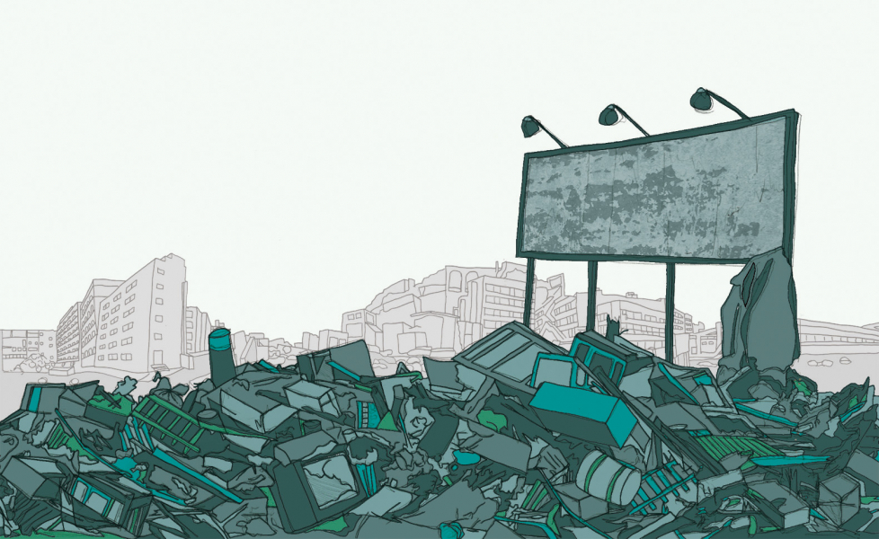

# OSCAR - the Ostensibly Smart Computer Aided Recycler

## DSI1019 Capstone Project by Billy Horn
---

## Problem Statement

It is estimated in the city of San Diego, CA that at least 15% of refuse intended to be recycled by the general population is actually sent to the landfill [source]. Although 15% may not seem like a big number, this translates to nearly ##### tons of garbage per month and ### tons of garbage per year. That's the size of a ####! The saddest part is much is much of this content could have been recycled, but was simply thrown into the wrong bin - the large blue bins at everyone's home that is picked up by the city every two weeks. All of us are guilty of this, the *wishful* recycling that occurs when you think something can be recycled but you're not sure, so you throw it into the recycling bin and hope for the best. Well, what happens is employees at the city of San Diego separate these wishful contents and send them to the landfill as they do not have the resources to take the recylables to the appropriate facilities. For example, plastic bags, styrofoam peanuts and plastic wrapping are all items the city finds in the blue bins on the regular. The city of San Diego does not process plastic bags or wrappin, but directs the public to take them to their local grocery stores, where the stores usually have recycling bins set up. Again, the city does not process styrofoam packing peanuts and lists several places online where the public can go to recycle them. However, every two weeks the city deals with separting these items from the other recyclable contents.

As I know most of the general public is too busy (or lazy, myself included) to look up what can be recycled in the blue bins and what cannot - and quite frankly the city websites do not make it easy - I have taken it upon myself to research a way that makes separating the refuse at home easier. This way the city is not burdened with it themselves, and it can free up resources to focus attention on other recycling efforts. The idea is to have an app on your phone or computer that can tell you if something can be recycled or not based on a photograph.

Welcome OSCAR - the Ostensibly Smart Computer Aided Recycler. Inspired by the grumpy, yet adorable Oscar the Grouch, it is a machine learning program that uses computer vision to classify garabge from a picture into five different categories:
- Trash
- Plastic
- Metal
- Paper
- Cardboard
- Glass

This project represents the MVP - Minimum Viable Product - of a full-fledged recycling sorting app. Although categorizing into these five classes doesn't tell you if the item can be recycled or not, it proves there is a viable opportunity for a recycling app provided there is enough data (pictures) from which the machine can learn.

## Table of Contents
- Software Requirements
- Methods of Analysis
- Data
- Website
- App
- Findings and Conclusions

## Software Requirements

- tensorflow
- numpy
- matplotlib
- PIL

## Website

This will be a section that talks about the website - where it is, why it exists (collect data) and how to use it.

## App

This is a section that will discuss the application on iOS - why it exists, how it works under the hood.

## Methods of Analysis

Convolutional Neural Network (CNN) with TensorFlow, using accuracy, loss, and precision as metrics.

## Data
### Do to the size of the data set, it has not been included in this repo. Please follow link below for downloading.

The data set from this project consists of over 2,500 total images separated into the five categories mentioned above. The images were collected and shared by [**Gary Thung**](https://github.com/garythung) and [**Mindy Yang**](https://github.com/yangmindy4) for their paper ( [**link**](http://cs229.stanford.edu/proj2016/poster/ThungYang-ClassificationOfTrashForRecyclabilityStatus-poster.pdf) ). More information on the data set and a download link can be found [**here**](https://github.com/garythung/trashnet#dataset).

## Findings and Conclusions

